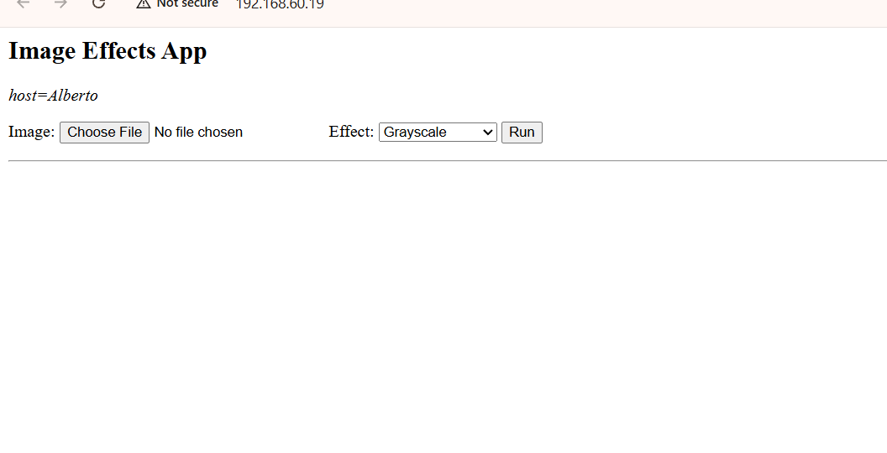
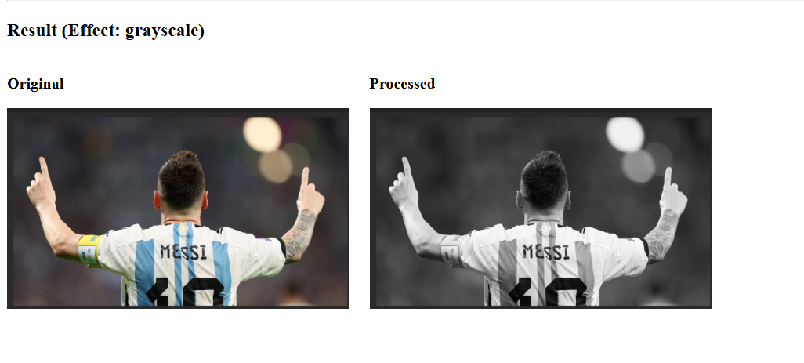
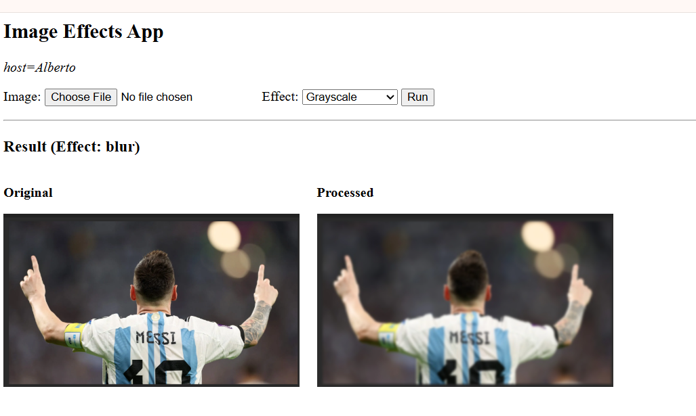
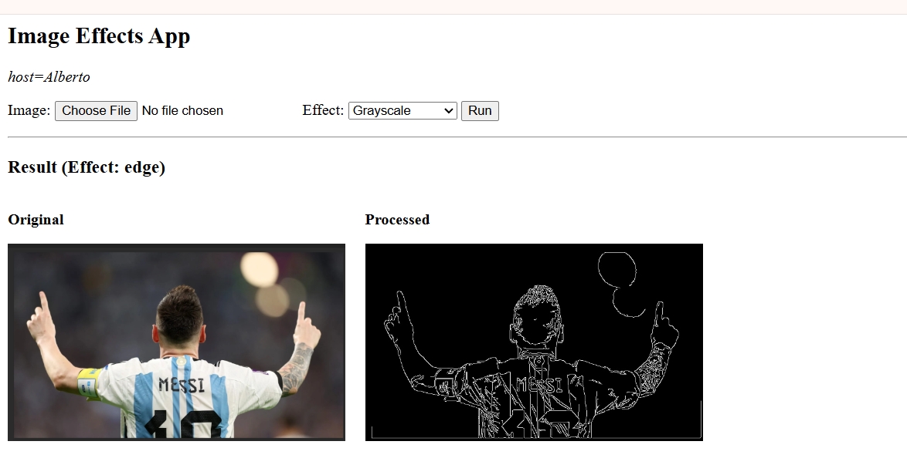
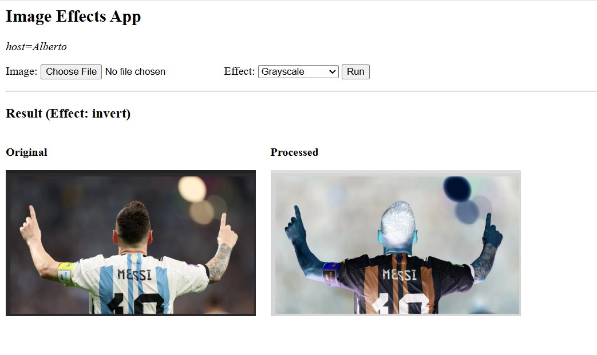

# Final Project

## Description

My final project will be a web application where users can upload an image and apply different image processing effects. The user will be able to choose between multiple effects such as grayscale, blur, edge detection, and color inversion. The application will process the image using OpenCV and display the result on a web page. I will build it using Python, Flask, OpenCV, and Docker. The goal is to create a simple and interactive tool for experimenting with image effects.

## Design

For this project, I am starting with the Docker template from class because it already provides a working Flask application that can run in a container and be deployed later. My plan is to keep the basic image upload flow from the template and then extend the image processing part so the user can choose from several effects instead of only one. In the first prototype, I want to make sure the user can upload an image, select an effect, submit the form, and see the processed result displayed on the web page.

I am approaching this project one step at a time. First, I will get one effect working correctly, such as grayscale or blur. After that, I will add more effects like edge detection and color inversion. OpenCV will be used to read and modify the images, Flask will handle the web page and file upload, and Docker will make sure the program runs the same way on my computer and on Render. During development, I may improve the layout of the page so it is easier for the user to understand and use.

Websites used:
- OpenCV Python Tutorials: https://docs.opencv.org/4.x/d6/d00/tutorial_py_root.html
- Flask Documentation: https://flask.palletsprojects.com/
- GeeksforGeeks OpenCV Project Ideas: https://www.geeksforgeeks.org/computer-vision/opencv-projects-ideas-for-beginners/

AI usage:
I used ChatGPT to help me brainstorm a project idea, improve my README description, and plan the design of the application. I asked for help choosing an easy but strong project idea, deciding which image effects to include, and understanding how the Flask upload page and OpenCV image processing should work together. I may continue using AI during development for debugging, documentation help, and improving the structure of the code.

## Implementation

I implemented my final project by modifying the class Docker template into a multi-effect image processing web application. The user can upload an image, choose an effect, and view both the original and processed image on the web page. The effects currently included are grayscale, blur, edge detection, and color inversion.

I used Flask to handle the web interface and file upload, and I used OpenCV to process the images. I also created folders for uploaded and processed images so the results could be displayed in the browser. During implementation, I added documentation at the top of the Python file and comments throughout the code to show how the program works.

AI usage during implementation:
I used ChatGPT during implementation to help me understand how to modify the Flask template, organize the code, add multiple image effects, and document my functions clearly. I also used AI help for debugging issues related to file paths, folder structure, and Python setup.

## Test

I tested the application locally in the browser using Flask. The home page loaded correctly and allowed me to upload an image and select an image processing effect.

### Test Results

- Home page test: The application opened successfully and displayed the upload form.  
  

- Grayscale test: The image was converted to black and white correctly.  
  

- Blur test: The image was blurred successfully.  
  

- Edge detection test: The edges of the image were detected correctly.  
  

- Invert colors test: The colors of the image were inverted correctly.  
  

### Summary

All features of the application worked correctly. The user can upload an image, select an effect, and see both the original and processed images on the web page.